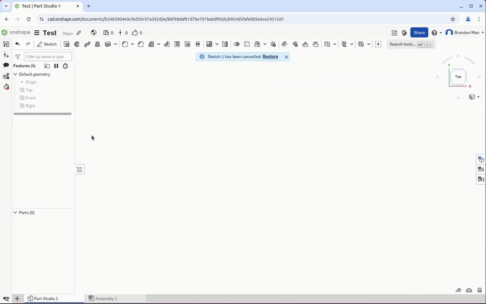
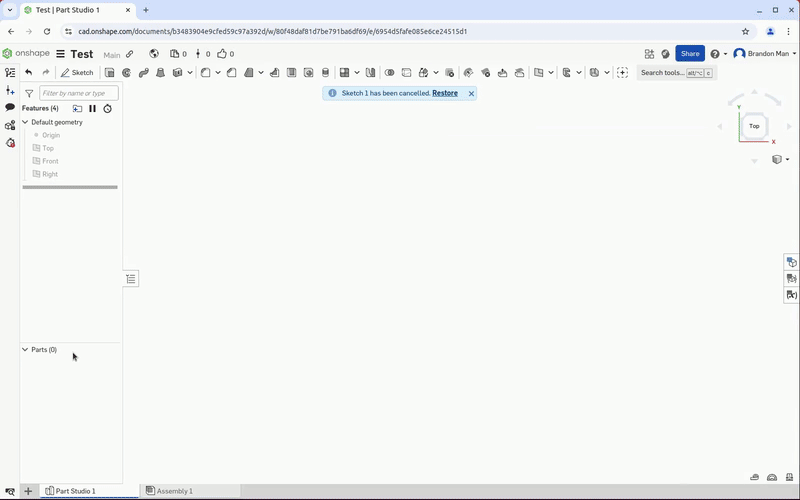
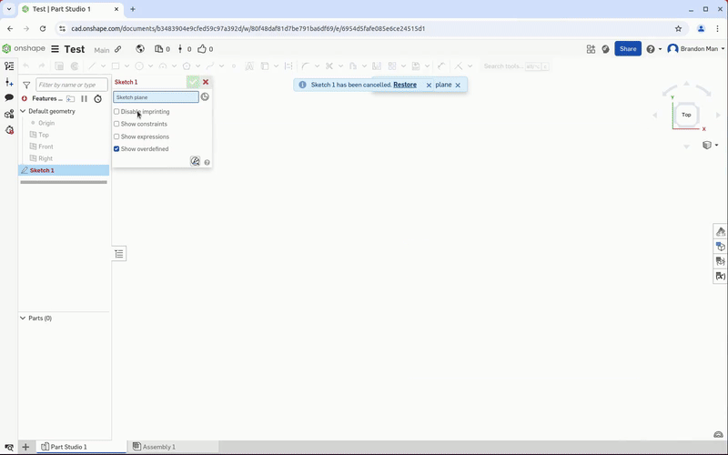
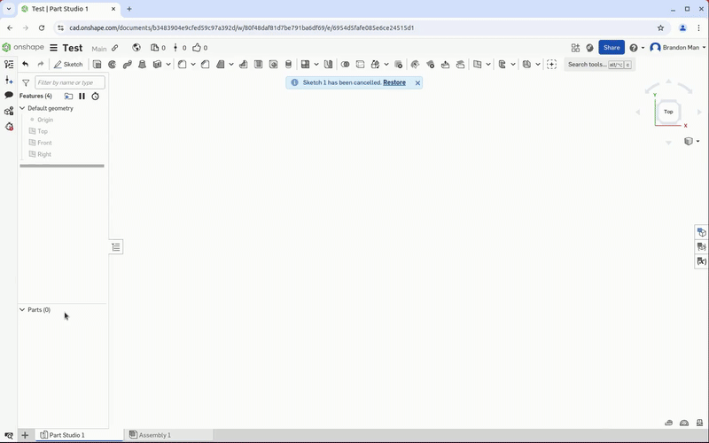
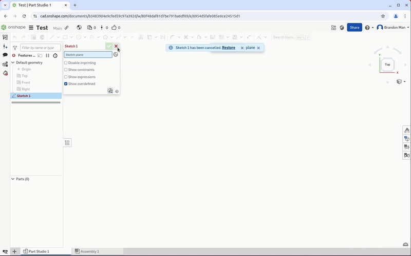
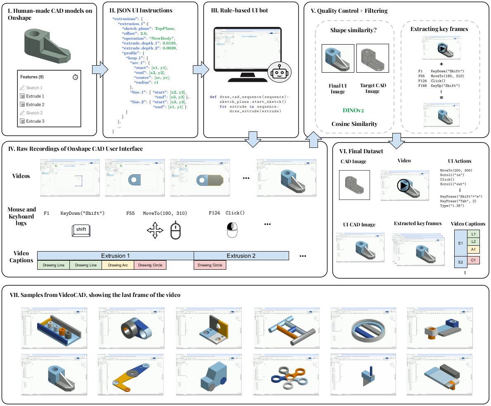

<div align="center">

## VideoCAD: A Dataset and Model for Learning Long‑Horizon 3D CAD UI Interactions from Video

> Brandon Man<sup>1\*</sup>, Ghadi Nehme<sup>1\*</sup>, Md Ferdous Alam<sup>1</sup>, Faez Ahmed<sup>1</sup> <br>
> <sup>1</sup>Massachusetts Institute of Technology  
> <sup>\*</sup>Equal Contribution

[](https://arxiv.org/abs/2505.24838) [](https://ghadinehme.github.io/videocad.github.io/) [](https://dataverse.harvard.edu/dataset.xhtml?persistentId=doi:10.7910/DVN/WX8PCK&faces-redirect=true)

</div>

<div align="center">
  <!-- Row 1 -->
  
  
  
  <br>
  <!-- Row 2 -->
  
  
  
</div>


---

## Introduction

**VideoCAD** is a large-scale video dataset designed to enable learning of precise user interactions in 3D CAD software. It provides over **41,000** high-resolution videos paired with timestamped UI actions and target CAD images, enabling multimodal learning for behavior cloning, visual understanding, and spatial reasoning.

---

## Key Features

- **41K+ CAD modeling videos** with synchronized UI screen recordings and action logs.
- **Low-level UI actions** (mouse, keyboard, typed input) and **high-level operations** (extrude, sketch).
- **Pixel-based action grounding**, requiring agents to reason about geometry and UI layout.
- **Long-horizon tasks**, with sequences up to 186 actions long, 20× longer than existing UI datasets.
- Applications: **behavior cloning**, **CAD generation**, **autocomplete**, **video QA**, **spatial reasoning**.


### Comparison with Other UI Interaction Datasets

| **Environment**        | **# Samples**     | **Time Horizon** | **3D Reasoning** | **Precise Elements** | **Avg. # Elements** |
|------------------------|------------------|------------------|------------------|----------------------|---------------------|
| OSWorld                | 369              | 15\*             | ❌               | ✅                   | --                  |
| Mind2Web               | 2,350            | 7.3              | ❌               | ❌                   | 1,135               |
| WebArena               | 812              | --               | ❌               | ❌                   | --                  |
| VisualWebArena         | 910              | 35\*             | ❌               | ❌                   | --                  |
| TheAgentCompany        | 175              | 40               | ❌               | ❌                   | --                  |
| WorkArena              | 33               | 15               | ❌               | ✅                   | --                  |
| WebShop                | 12,000           | 11.3             | ❌               | ❌                   | 38                  |
| OmniAct                | 9,802            | --               | ❌               | ✅                   | --                  |
| WebLinx                | 2,337            | 43               | ❌               | ❌                   | 1,849               |
| AITW                   | **715,142**      | 6.5              | ❌               | ❌                   | --                  |
| MMINA                  | 1,050            | 12.9             | ❌               | ✅                   | 601                 |
| MetaGUI                | 1,125            | --               | ❌               | ❌                   | 79                  |
| PixelHelp              | 187              | 4.2              | ❌               | ❌                   | --                  |
| AndroidWorld           | 116              | 18.1             | ❌               | ✅                   | --                  |
| AgentStudio            | 304              | 30\*             | ❌               | ✅                   | --                  |
| MoTIF                  | 4,707            | 4.4              | ❌               | ❌                   | 188                 |
| AndroidArena           | 116              | 11.4             | ❌               | ❌                   | --                  |
| WindowsAgentArena      | 154              | 8.1              | ❌               | ✅                   | --                  |
| MiniWoB++              | 125              | 3.6              | ✅               | ❌                   | 28                  |
| GUI-WORLD              | 12,379           | 10.97            | ✅               | ✅                   | --                  |
| **VideoCAD**           | **41,005**       | **186**          | ✅               | ✅                   | **6,740**           |

<sup>\* Max is used when average is not reported</sup>

---


## Dataset Generation Pipeline

<div align="center">
  
</div>

---

## Dataset Structure on Harvard Dataverse

```
🔹 0000.zip /... 0249.zip      # UI screen recordings at 60 FPS
🔹 cad_imgs.zip                # Rendered isometric view of CAD models
🔹 action_raw.zip              # Low-level UI action sequences
🔹 mouse_raw.zip               # High-level descriptions (extrusions, primitives, parameters, etc.)
🔹 action_json.zip             # Low-level UI action sequences (JSON format)
🔹 mouse_json.zip              # High-level descriptions (extrusions, primitives, parameters, etc.) (JSON format)
```

---

## Data Preprocessing

Before training or evaluation, you need to preprocess the raw VideoCAD data from the Harvard Dataverse.

### 1. Download Raw Data

Download the raw VideoCAD dataset from the [Harvard Dataverse](https://dataverse.harvard.edu/dataset.xhtml?persistentId=doi:10.7910/DVN/WX8PCK&faces-redirect=true) and organize it as follows:

```
data/
├── data_raw/
│   ├── videos/           # Video files (.mp4)
│   ├── mouse/            # Mouse action log files (.log)
│   └── images/           # Target CAD images (.png)
└── data_resized/         # Processed data (created by preprocessing)
```

You can find the images here: [cad_imgs.zip](https://drive.google.com/file/d/17-UkgyTRoWEQEHUsX4x_-hRnQci4lqhy/view?usp=sharing)

### 2. Run Data Preprocessing

Process the raw data into the format expected by the training scripts:

```bash
python generate_dataset.py
```

This script will:
- Extract video frames at action timestamps
- Convert mouse logs to action vectors
- Resize images to (224, 224)
- Create pickle files with synchronized frames, actions, and timestamps
- Copy target CAD images to the processed directory

The processed data will be saved in `data/data_resized/` with the following structure:
```
data/data_resized/
├── 0000/
│   ├── 00000070_data.pkl    # Contains frames, actions, timesteps
│   ├── 00000070.png         # Target CAD image
│   └── ...
└── dataset_split.json       # Train/val/test split (create manually)
```

### 3. Dataset Split

We provide a JSON file `data/data_resized/dataset_split.json` that defines the train/validation/test split:

```
{
  "00000070": "train",
  "00000073": "val", 
  "00000123": "test",
  ...
}
```

---


## VideoCADFormer

We introduce **VideoCADFormer**, a multimodal transformer benchmark designed for learning and evaluating long-horizon CAD user interface (UI) action prediction from video.
Trained on the VideoCAD dataset, it models temporal dependencies between visual states and symbolic actions, enabling both accurate imitation and sequence planning in complex CAD environments.

### Quick Start

Ensure you have the environment installed:

```bash
conda create -n videocadformer python=3.9
conda activate videocadformer
pip install -r requirements.txt
```

### Training

Train the VideoCADFormer model using the default configuration:

```bash
python main.py
```

Or customize the training parameters:

```bash
python main.py \
  --dataset_path data/data_resized \
  --config_path data/data_resized/dataset_split.json \
  --model_config model_configs/transformer_experiments.json \
  --model_name cad_past_10_actions_and_states_timestep_embedding \
  --checkpoint_dir checkpoints \
  --epochs 1000 \
  --batch_size 2 \
  --num_workers 2
```

### Evaluation

Test a trained model checkpoint:

```bash
python test.py \
  --checkpoint_folder cad_past_10_actions_and_states_timestep_embedding_2025_10_19_18_55_03 \
  --output_root_dir test_results
```

Or specify a custom checkpoint path:

```bash
python test.py \
  --checkpoint_folder my_experiment \
  --checkpoint_path checkpoints/my_experiment/best_model.pt \
  --dataset_path data/data_resized \
  --config_path data/data_resized/dataset_split.json \
  --output_root_dir evaluation_results
```

The evaluation script will generate:
- **Performance metrics**: Command accuracy, parameter accuracy, sequence accuracy
- **Analysis plots**: Confusion matrices, error analysis, tolerance curves
- **Sample outputs**: Predicted action sequences for test samples

**Pre-trained Checkpoint**: Download our trained VideoCADFormer model from [here](https://drive.google.com/file/d/1dWa8gZ56tXCLXzhuTTKjhq2bteUDf1ZH/view?usp=sharing).

---

## Citation

If you find our work helpful, please consider citing:

```bibtex
@inproceedings{manvideocad,
  title={VideoCAD: A Dataset and Model for Learning Long-Horizon 3D CAD UI Interactions from Video},
  author={Man, Brandon and Nehme, Ghadi and Alam, Md Ferdous and Ahmed, Faez},
  booktitle={The Thirty-ninth Annual Conference on Neural Information Processing Systems Datasets and Benchmarks Track}
}
```

---

## Contact

For questions, issues, or collaboration, please contact: `ghadi@mit.edu`

---
